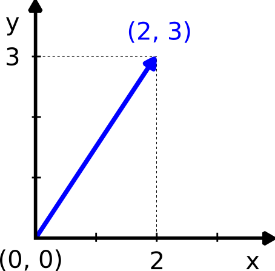
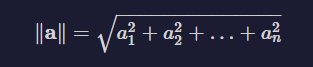
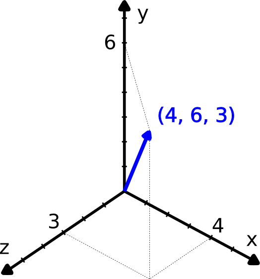

# Vectors
- A `vector` is an object that has a `length (or magnitude)` and a `direction` and it **cannot** be expressed by a single number. 

- In physics, vectors are commonly used to represent forces, velocities, accelerations, and other quantities.

- A vector can be defined by two coordinates, `x` and `y`, in the Euclidean plane. 

- The distance between the origin of the axes and the point `(x, y)` will be its length, or norm. And the vector direction will point towards `(x, y)`.

The length of a vector  `a` , or `norm`, is typically indicated as  `∥a∥`. 
It can be calculated as the square root of the sum of its squared components:

A vector can have a number n of dimensions (components). Here's a representation of a 3-dimensional vector:

